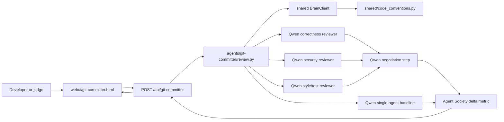

# Track 3 Architecture: git-committer Agent Society

`git-committer` is the Track 3 submission path for the Qwen Cloud hackathon.
It turns a unified diff into a negotiated code-review verdict by running three
specialist Qwen reviewers, then comparing the team result with a single-agent
baseline.

## Agent Roles

| Role | Responsibility | Output |
|---|---|---|
| Correctness reviewer | Logic bugs, edge cases, behavioral regressions | JSON issue list |
| Security reviewer | Secrets, injection, auth gaps, unsafe data handling | JSON issue list |
| Style/test reviewer | Maintainability, naming, dead code, missing tests | JSON issue list |
| Negotiator | Deduplicate, rank severity, resolve conflicts | Final verdict JSON |
| Baseline reviewer | Single-pass holistic review for comparison | JSON issue list |

## Data Flow



## Why This Fits Track 3

The project demonstrates multiple agents with distinct capabilities, explicit
task division, a negotiation step, and a measurable efficiency signal. The
`metric.delta` field compares multi-role issue discovery against a single-agent
baseline over the same diff.

## Runtime Entry Points

```bash
# CLI: JSON output for judging and tests
python agents/git-committer/review.py --diff-file sample.patch

# CLI: text output for demos
git diff HEAD~1 | python agents/git-committer/review.py --format text

# Web UI
node webui/server.mjs
# open http://localhost:4321/git-committer.html
```

## Alibaba Cloud Deployment Proof

The deployment proof file is `agents/git-committer/deploy.py`. It uses Alibaba
Cloud ECS SDK calls to create and start an instance, then user-data installs the
repo and starts `webui/server.mjs` as a systemd service. The DashScope key is
not placed in user-data; the instance reads it from
`/etc/qwen-agent-collective.env`.

Dry-run proof command:

```bash
python agents/git-committer/deploy.py --dry-run
```

Real deploy requires:

```bash
export ALIBABA_CLOUD_ACCESS_KEY_ID=...
export ALIBABA_CLOUD_ACCESS_KEY_SECRET=...
export ALIBABA_CLOUD_REGION=cn-hangzhou
export ALIYUN_ZONE_ID=...
export ALIYUN_SECURITY_GROUP_ID=...
export ALIYUN_VSWITCH_ID=...
export ALIYUN_IMAGE_ID=...
python agents/git-committer/deploy.py
```
